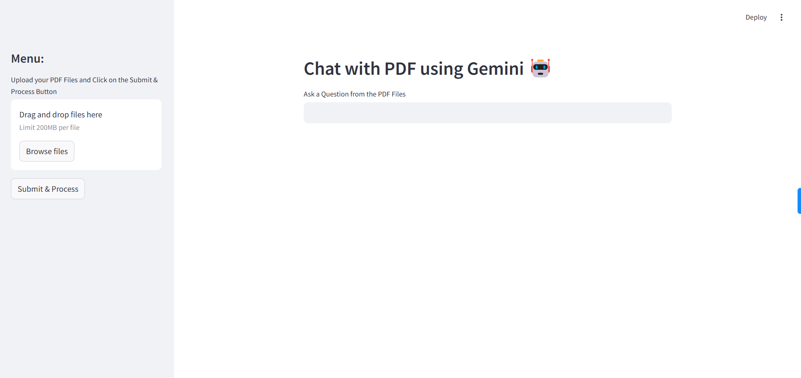
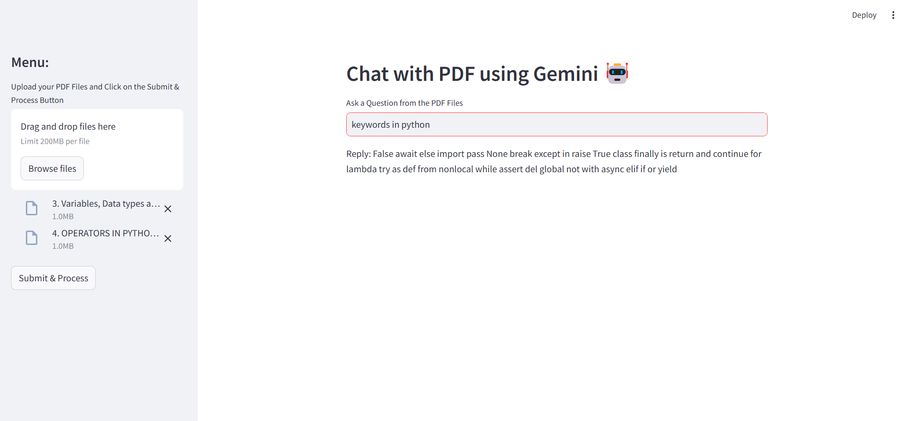

# PDFGenius: Master Your Documents with AI

### Overview
This application allows users to interact with PDF documents through a conversational interface powered by Google Generative AI and LangChain. Users can upload PDF files, ask questions based on the content of those files, and receive detailed answers.

---

### Features
- **PDF Upload**: Upload multiple PDF files for processing.
- **Text Extraction**: Extract text from uploaded PDFs using `PyPDF2`.
- **Text Chunking**: Split extracted text into manageable chunks using LangChain's `RecursiveCharacterTextSplitter`.
- **Vector Store Creation**: Generate embeddings for text chunks using Google Generative AI and store them in a FAISS index.
- **Conversational Interface**: Ask questions about the uploaded PDFs and receive answers based on the context.

---

### Technologies Used
- **Streamlit**: For building the user interface.
- **PyPDF2**: For extracting text from PDF files.
- **LangChain**: For text chunking, vector store creation, and conversational chains.
- **Google Generative AI**:
  - Embeddings (`GoogleGenerativeAIEmbeddings`).
  - Conversational model (`ChatGoogleGenerativeAI`).
- **FAISS**: For storing and querying vectorized text chunks.
- **dotenv**: For managing environment variables (API keys).

---

### Installation

1. Clone the repository:
   ```bash
   git clone 
   cd 
   ```

2. Install dependencies:
   ```bash
   pip install streamlit PyPDF2 langchain google-generativeai faiss-cpu python-dotenv
   ```

3. Set up your environment variables:
   - Create a `.env` file in the project directory.
   - Add your Google API key:
     ```
     GOOGLE_API_KEY=your_google_api_key_here
     ```

---

### Usage

1. Run the application:
   ```bash
   streamlit run app.py
   ```

2. Open the application in your browser (default URL: `http://localhost:8501`).

3. Upload PDF files via the sidebar menu.

4. Click "Submit & Process" to extract and process text from the PDFs.

5. Use the text input field to ask questions about the content of the uploaded PDFs.

---

### Code Structure

#### Functions
1. **`get_pdf_text(pdf_docs)`**
   - Extracts text from uploaded PDF files.

2. **`get_text_chunks(text)`**
   - Splits extracted text into smaller chunks for processing.

3. **`get_vector_store(text_chunks)`**
   - Creates a FAISS vector store from text chunks using embeddings.

4. **`get_conversational_chain()`**
   - Sets up a conversational chain with a custom prompt template.

5. **`user_input(user_question)`**
   - Handles user queries by searching the vector store and generating responses.

#### Main Application Flow
1. Sidebar for uploading PDFs.
2. Processing button to extract and chunk text.
3. Text input field for asking questions.
4. Display of responses generated by the conversational chain.

---

### Streamlit Deploy





### Notes
- Ensure you have a valid Google API key to use Google Generative AI services.
- The FAISS index is saved locally as `faiss_index`; ensure proper permissions for file storage.
- Avoid uploading sensitive or confidential documents, as processing involves external embeddings.

---

### Future Enhancements
- Add support for other document formats (e.g., Word, TXT).
- Improve response accuracy by fine-tuning prompt templates.
- Enable cloud-based storage for FAISS indices to support larger datasets.

---

## Contributions

Contributions are welcome! Feel free to open issues or submit pull requests.

---

## Contact

For any queries, reach out to suyashbargal@gmail.com
